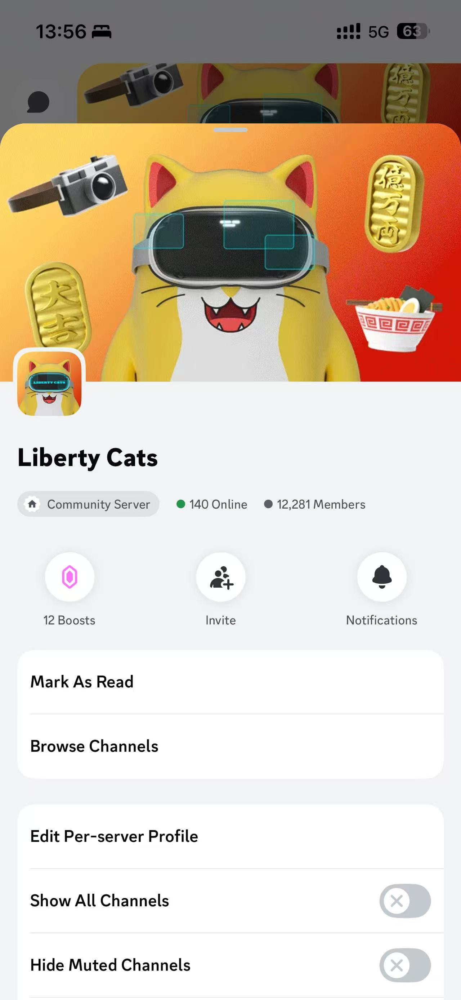
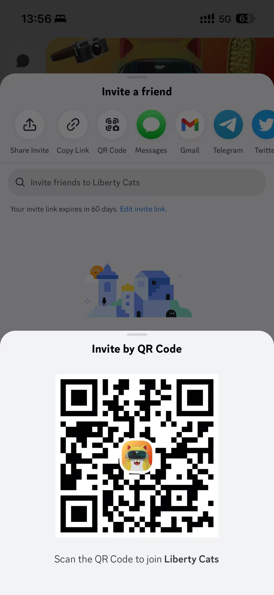
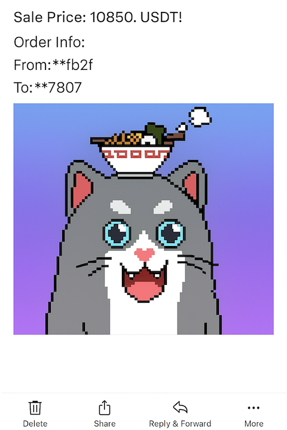

<h1 align="center">
  
  LibertyCatMonitor
</h1>
<p align="center">
  <b>Automated NFT monitoring and notification service for LibertyCat Marketplace</b><br>
  <sub>Built with Kotlin Multiplatform · Email & SMS Alerts · REST API · Scheduler</sub>
</p>

<p align="center">
  <a href="https://github.com/xumeng367/LibertyCatMonitor/stargazers">
    
  </a>
  <a href="https://github.com/xumeng367/LibertyCatMonitor/network/members">
    
  </a>
  <a href="https://github.com/xumeng367/LibertyCatMonitor/issues">
    
  </a>
  <a href="https://github.com/xumeng367/LibertyCatMonitor/blob/main/LICENSE">
    
  </a>
</p>

---

### 🚀 Quick Start

```bash
# 1. Clone the repository
git clone https://github.com/xumeng367/LibertyCatMonitor.git
cd LibertyCatMonitor/server

# 2. Configure recipients
# Edit Configs.kt to add your email and/or phone numbers

# 3. Run
./gradlew :server:run
# or
java -jar build/libs/server.jar

# 4. Verify
curl http://localhost:8080/api/health
```

---

### 🧩 Highlights

- 🔍 **Real-time NFT monitoring** for LibertyCat and OKX marketplaces
- 📧 **Email + SMS notifications** (SMTP or third-party API)
- ⏱ **Background scheduling** for automatic event polling
- 🌐 **REST API** for health checks and manual trigger
- 🛠 **Kotlin Multiplatform architecture**, modular and extendable

---

## 🐱 Overview

**LibertyCatMonitor** is a **Kotlin Multiplatform (KMP)** server-side application that monitors NFT activity on the **LibertyCat marketplace**, including **new listings** and **sales**, then notifies recipients via **email** or **SMS** in real time.

It provides a clean modular architecture with background tasks, REST endpoints, and easy customization for other NFT data sources.

---

## 💬 Connect with us（Discord Community）
<h1></h1>
join the Discord Community
<h1></h1>


## 🧩 Project Structure

```
server/
└── src/main/kotlin/com/libertycat/kmp/demo/
    ├── beans/
    │   └── NetWorkBeans.kt          # Define network dependencies (e.g., OkHttpClient)
    ├── component/
    │   └── CatMonitorTasks.kt       # Core scheduler: fetch, filter, and notify
    ├── controller/
    │   └── CatRestController.kt     # REST API endpoints
    ├── mail/
    │   └── MailManager.kt           # Handles email sending (SMTP)
    ├── network/
    │   └── OkxHttpRepository.kt     # Fetch NFT data from LibertyCat/OKX
    ├── sms/
    │   └── SmsManager.kt            # Optional SMS integration
    ├── web3/
    │   └── Tokens.kt                # Web3 constants and utilities
    ├── Configs.kt                   # Email/SMS recipient list
    └── DemoApplication.kt           # Main entry point
```

---

## ⚙️ Configuration Guide

### 📧 Email & SMS Recipients

Edit `Configs.kt` to define your notification targets:

```kotlin
val emailsReceivers = listOf(
    "example@gmail.com",
    "another@example.com",
)

val smsReceivers = listOf(
    "+819012345678",
)
```

You may also load these dynamically from environment variables or YAML configuration.

---

### 📬 Email notification Screenshot
<h1></h1>
---

### 📬 Email Configuration (`application.yml`)

Configure your SMTP provider:

```kotlin
username: your_username@qq.com
password: your_password
host: your_host
port: your_port
```

Supports plain text by default; can be extended for HTML templates or attachments.

---

### 📱 SMS Notifications (`Configs.kt`)

Optional: integrate with your preferred SMS gateway (e.g., **Twilio**, **Aliyun**, **Tencent Cloud**):

```kotlin
val smsApiKey = "YOUR_SMS_API_KEY"
val smsSecret = "YOUR_SMS_SECRET"
```

---

### 🌐 Network Layer (`OkxHttpRepository.kt`)

Handles all HTTP calls to external NFT data sources:

- Fetches LibertyCat/OKX NFT listings and sales
- Parses JSON responses
- Provides data to monitoring tasks

Easily extendable to support more marketplaces (e.g., OpenSea, Blur).

---

## 🔁 Core Logic (`CatMonitorTasks.kt`)

Main scheduling and monitoring flow:

1. Periodically calls `OkxHttpRepository` to fetch new NFT events
2. Filters duplicates or irrelevant entries
3. Sends alerts via `MailManager` and/or `SmsManager`
4. Logs all actions for audit/debugging
5. Exposes manual trigger through REST endpoint

---

## 🧱 Running the Server

### 1️⃣ Build
```bash
./gradlew build
```

### 2️⃣ Run
```bash
./gradlew :server:run
# or
java -jar build/libs/server.jar
```

**Production tips:**
- Use `logback` or `slf4j` for file-based logs
- Enable rotation and structured log formats (JSON)

---

## 🧠 System Workflow

```
          ┌────────────────────────┐
          │     CatMonitorTasks     │
          │  Scheduled event fetch  │
          └─────────────┬───────────┘
                        │
                        ▼
           ┌────────────────────────┐
           │    OkxHttpRepository    │
           │ Fetch & parse NFT data  │
           └─────────────┬───────────┘
                        │
                        ▼
           ┌────────────────────────┐
           │ MailManager/SmsManager │
           │ Notify via email/SMS   │
           └────────────────────────┘
```

---

## 🧪 Testing

Run tests:
```bash
./gradlew :server:test
```

Recommended unit tests:
- `MailManagerTest` — verify SMTP sending
- `CatMonitorTasksTest` — mock NFT events and filtering
- `OkxHttpRepositoryTest` — handle timeout/retry behavior

---

## 📦 Deployment

| Environment | Recommended Setup |
|--------------|------------------|
| Local Development | Run directly via IntelliJ / `DemoApplication.kt` |
| Cloud Server | Use Docker container |
| Production | Deploy with systemd/Supervisor (auto-restart enabled) |

**Docker Example:**
```dockerfile
FROM eclipse-temurin:17
WORKDIR /app
COPY build/libs/server.jar .
CMD ["java", "-jar", "server.jar"]
EXPOSE 8080
```

---

## 🧰 Roadmap

- [ ] WebSocket real-time streaming
- [ ] Telegram / Discord notification support
- [ ] Support for OpenSea & Blur marketplaces
- [ ] Redis-based cache and deduplication
- [ ] Web dashboard for analytics

---

## 👨‍💻 Author

**Xu Meng (许萌)**  
📧 [xumeng367@gmail.com](mailto:xumeng367@gmail.com)  
💻 [GitHub: xumeng367](https://github.com/xumeng367)

---

## 📜 License

This project is licensed under the **MIT License**.  
You are free to use, modify, and distribute it — but please retain author attribution.

---

<p align="center">
  <b>Made with ❤️ by Xu Meng</b><br>
  <sub>Monitoring the NFT world, one transaction at a time.</sub>
</p>
